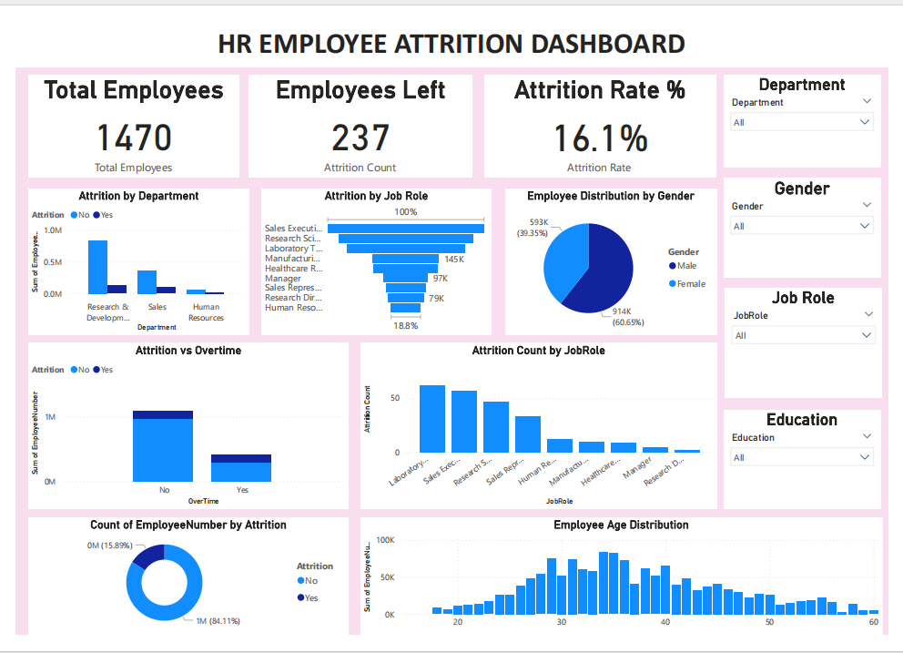

# HR Employee Attrition Analysis 

## Project Overview

This project analyzes employee attrition using the IBM HR Analytics dataset.
The goal is to understand the factors that influence employees leaving the company and provide insights that can help improve employee retention.

## Dataset

IBM HR Analytics Employee Attrition dataset
Total Employees: 1470

## Tools Used

* Microsoft Excel – Data cleaning and preprocessing
* SQL – Data analysis queries
* Python – Exploratory Data Analysis (EDA)
* Power BI – Interactive dashboard and visualization
* GitHub – Project hosting and portfolio

## Key Metrics

* Total Employees: 1470
* Employees Left: 237
* Attrition Rate: 16.1%

## Dashboard Insights

* The Sales department has higher employee attrition compared to other departments.
* Employees working overtime are more likely to leave the organization.
* Certain job roles show higher employee turnover.
* Younger employees tend to leave more frequently than older employees.

## Dashboard Features

* KPI cards displaying key workforce metrics
* Attrition analysis by department and job role
* Attrition vs overtime comparison
* Employee demographic insights (gender and age distribution)
* Interactive filters for Department, Gender, Job Role, and Education

## Dashboard Preview

